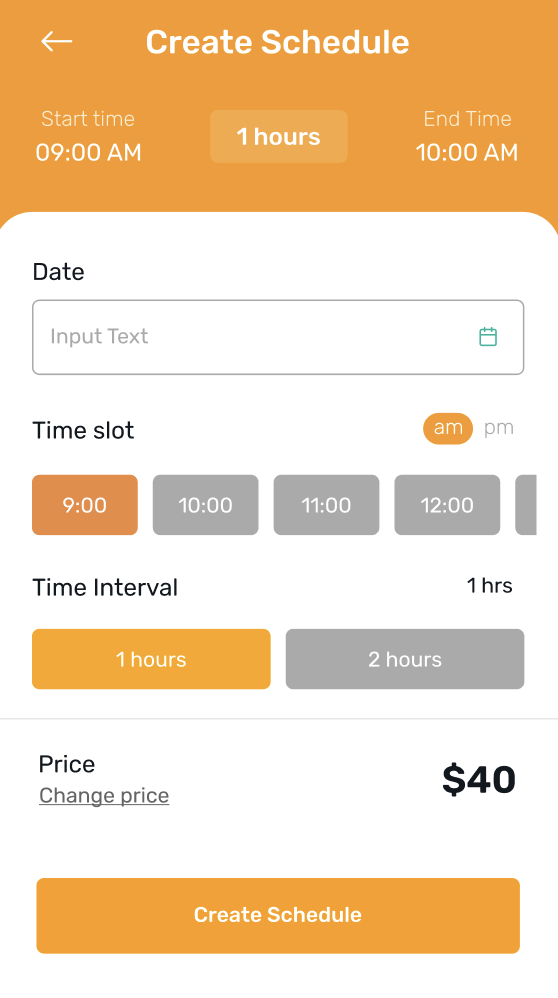
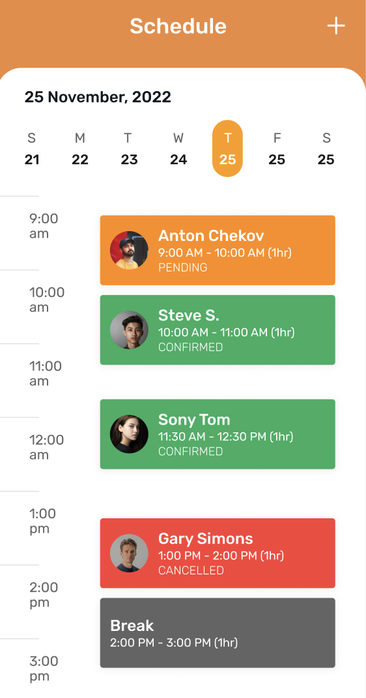
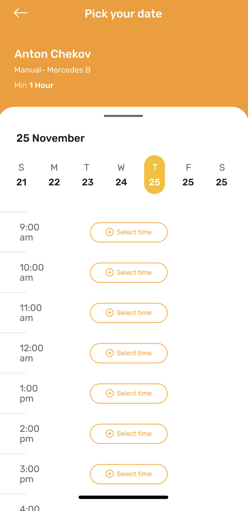
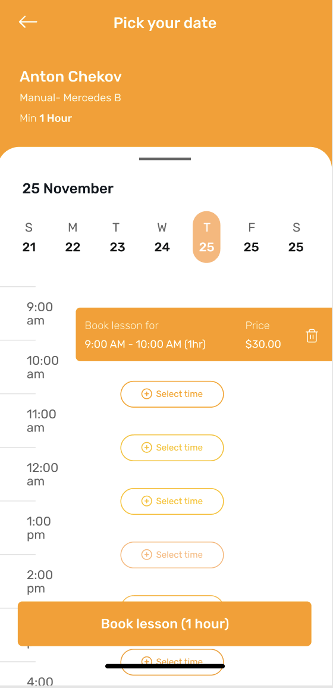

🚀 Ready to use booking interface based on DateTime. Can be used for both user types 🚀 

##### Evaluate this package for your need

Before reading further, lets evaluate if this package can be useful for your need or not. If you are building a project where you want admins or some users to create time slots for specific date which can be later booked by other users, then this might be the perfect package for you.

💗 User Types (terms used for two types of users): 💗

- Creator: provides service to book based on date and time. (Can be admins, doctor, restaurant, barber, plumber or anyone who provides service)
- Booker: uses app to book service

## 💗 Features 💗

###### 🥷🏽 For Creator 🥷🏽

- Interface to create time slot for any specific date which can be later used by other users to view/book.
- Interface to view time slot for selected date and view information like time, price, who booked the timeslot, booking status.

###### 🎉 For Booker 🎉

- Interface to view time slots of selected date. Time slots of this selected date can be filtered as per the need. Example: time slots of only the specific UserWhoServes, or time slots of specific price range, or time slots specific to time range.
- Interface to choose one or many time slots to book.

## 💗 Usage 💗

Screenshots:

  
  
  
  

###### 🥷🏽 For Creator 🥷🏽

- later to provide implementation on building interface for creator

###### 🎉 For Booker 🎉

- later to provide implementation on building interface for booker

#### 📚 Full documentation 📚

You can browse the full documentation fo this package here:

#### 🔥 Issue, Feedback and Contribution 🔥

For any of the purpose, please visit to the GitHub repository and do your part and lets make this package better for everybody. 🙏
